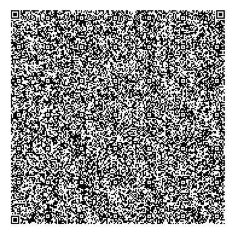

# ImmuneSecure reference implementation

This repository comprises a reference implementation (in Python3), and proof-of-concept, of the ImmuneSecure antibody-passport proposal. To generate an example paper-based credential run [Generate_QR_Credential.py](Generate_QR_Credential.py), to verify run [Verify_QR_Credential.py](Verify_QR_Credential.py). Credentials, which can be displayed as standard "version 40" QR codes, are signed using ECDSA over brainpoolP512r1 and comprise a user photo, name, a unique Certificate ID (CID) number and a validity period.

Example credential:

Which comprises the following example image (145x170 Greyscale), the name "John Doe", the validity period "16052020-16082020", the CID 0x1fc60e1a4e238ac6cce9d79097a268af and a valid 512-bit ECDSA signature.

Example image:

Dependencies are as follows:
* [matplotlib](https://pypi.org/project/matplotlib/)
* [opencv-python3](https://pypi.org/project/opencv-python/)
* [qrcode 6.1](https://pypi.org/project/qrcode/)
* [zbar](http://zbar.sourceforge.net)
